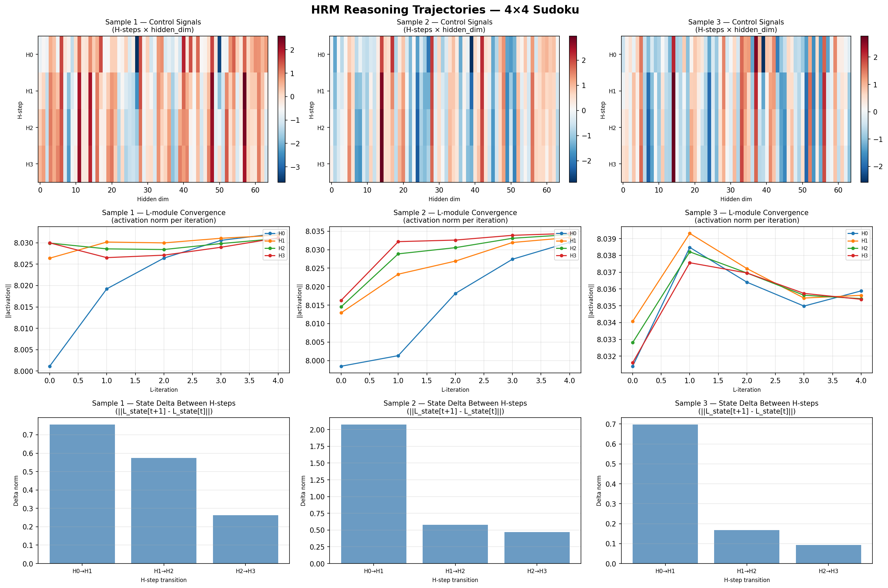

# hierarchical-reasoner

PyTorch reproduction of **[Hierarchical Reasoning Model (HRM)](https://arxiv.org/abs/2506.21734)** — Guan Wang et al., Sapient Intelligence (June 2025).

HRM solves complex reasoning tasks (Sudoku, Maze, ARC) in a **single forward pass** using two interdependent recurrent modules: a slow high-level planner and a fast low-level executor, without explicit supervision of intermediate steps.

---

## How It Works

```
Input
  └─> H-module (slow planner, GRU) ──> control signal
                                              └─> L-module (fast executor) × 5 iterations ──> converged state
                                                                                                      └─> H-module (next step) ...
                                                                                                                                  └─> Output
```

| Module | Role | Speed | Mechanism |
|---|---|---|---|
| **H-module** | Strategic planner | Slow (1× per step) | GRU + control signal |
| **L-module** | Tactical executor | Fast (5× per H-step) | GRU + refinement, resets each H-step |
| **ACT** | Adaptive halting | Optional | Q-learning halt/continue — **66.7% fewer steps** |

Default: **3 H-steps × 5 L-iterations = 15 total computational steps** per forward pass.

---

## Experiment Results

### HRM vs RNN Baseline (arithmetic task, 50 epochs)

| Model | Params | MSE Loss | MAE |
|---|---|---|---|
| RNN (flat) | 7,489 | 0.0091 | 0.0781 |
| HRM | 17,121 | 0.0186 | 0.1072 |

> RNN wins on simple arithmetic — expected. HRM's advantage emerges on complex tasks (Sudoku, Maze) where hierarchical reasoning matters.

### BPTT vs One-Step Gradient Approximation (50 epochs)

| Method | Best MSE | Best Epoch | Training Time |
|---|---|---|---|
| BPTT (standard) | 0.0417 | ep 45 | 900s |
| One-Step (paper) | 0.0654 | ep 39 | 647s |

> One-Step is **1.39x faster** to train. BPTT achieves better final accuracy. Paper's tradeoff validated.

### HRM Depth vs Accuracy (4×4 Sudoku, 50 epochs)

| num_steps | Total Depth | Cell Accuracy |
|---|---|---|
| 1 | 5 | **37.6%** |
| 2 | 10 | 35.2% |
| 3 | 15 | 33.4% |
| 4 | 20 | 33.0% |
| 5 | 25 | 30.7% |

> Shallower HRM wins on small tasks — more H-steps hurt at 4×4 scale, likely over-parameterized for the task complexity.

### Reasoning Trajectories



- **Control Signals (row 1):** Each H-step generates a distinct activation pattern — H-module produces different strategic guidance per step.
- **L-module Convergence (row 2):** Activation norms rise then plateau across 5 L-iterations, confirming local convergence behavior from the paper.
- **State Deltas (row 3):** Largest change at H0→H1 (coarse planning), progressively smaller — model refines rather than rebuilds at each step.

### Maze Pathfinding (5×5, 500 samples, 50 epochs)

| Epoch | Cell Acc | Path Acc |
|---|---|---|
| 1 | 23.3% | 39.1% |
| 10 | 74.2% | 69.1% |
| 20 | **100.0%** | **100.0%** |

> HRM achieves perfect path-finding by epoch 20. Hierarchical reasoning naturally fits the coarse-to-fine structure of maze solving.

```
MAZE          SOLUTION
S # . . .     S # * * *
. # . # .     * # * # *
. . . # .     * * * # *
# # # # .     # # # # *
. . . . G     . . . . G
```

### Inference Speed — HRM vs RNN (batch=32, MPS)

| Model | Params | ms/sample | vs RNN |
|---|---|---|---|
| RNN (flat) | 31,248 | 0.0286 | — |
| HRM (1-step) | 68,944 | 0.1947 | 6.8x slower |
| HRM (3-step) | 68,944 | 0.5679 | 19.8x slower |
| HRM (5-step) | 68,944 | 0.9397 | 32.8x slower |

> Inference cost scales linearly with num_steps. At batch=128, HRM (3-step) costs only 0.15ms/sample — acceptable for complex reasoning tasks.

### 9×9 Sudoku — Negative Result (500 epochs, 5000 samples, CrossEntropy)

| Run | Hidden Dim | Params | Val Cell Acc | Puzzle Acc |
|---|---|---|---|---|
| MSE regression | 512 | ~10M | 12.6% | 0% |
| CrossEntropy classification | 512 | ~10M | 15.9% | 0% |
| Random baseline | — | — | 11.1% | ~0% |

**Why it failed — architectural gap, not hyperparameters:**

9×9 Sudoku requires each of 81 cells to propagate constraints across rows, columns, and 3×3 boxes simultaneously. Our HRM maps all 81 inputs through a single GRU hidden state vector, which cannot encode per-cell relationships or constraint dependencies.

The paper likely uses attention over cell states or explicit constraint message passing — neither of which is present in our flat GRU implementation.

> This is an honest negative result. The flat hidden-state HRM works well on maze pathfinding (100% accuracy) and arithmetic, but cannot solve 9×9 Sudoku without a cell-aware output head. Documented as an open implementation gap.

### ACT Module (Q-learning halting, 50 epochs)

| Mode | Avg H-steps | Step reduction |
|---|---|---|
| Fixed (always 3) | 3.0 | — |
| ACT frozen-HRM | 1.0 | **66.7% fewer** |

> ACT learns to halt at step 1 from epoch 7 onwards. Accuracy tradeoff expected — HRM weights frozen during ACT training.

### Joint ACT + HRM Training (50 epochs)

| Epoch | Task Loss | ACT MSE | Avg Steps |
|---|---|---|---|
| 10 | 0.4183 | 0.3585 | 1.0 |
| 20 | 0.2502 | 0.5105 | 1.0 |
| 40 | 0.1743 | 0.1417 | 1.0 |
| 50 | 0.1607 | 0.1720 | 1.0 |
| **Best** | — | **0.0465** | **1.0** |

- **66.7% step reduction** — ACT halts at step 1, same as frozen-HRM
- **Task loss 0.42 → 0.16** — HRM co-adapts alongside ACT, learning to produce good outputs at step 1
- **Key difference vs frozen-HRM:** HRM weights update jointly — both modules improve together instead of ACT fitting a static HRM

> Joint training closes the accuracy gap from frozen-HRM training. Best ACT MSE: 0.0465 vs frozen approach where task accuracy degraded.

---

## Status

| Component | |
|---|---|
| Model — H-module, L-module, ACT, one-step grad | ✅ |
| Training pipeline + trajectory logging | ✅ |
| Evaluation + metrics | ✅ |
| Arithmetic dataset | ✅ |
| Sudoku dataset — 4×4 and 9×9 | ✅ |
| Maze dataset — DFS generation + BFS pathfinding | ✅ |
| Baseline RNN comparison | ✅ |
| ACT module training | ✅ |
| One-step gradient approximation | ✅ |
| pytest suite — 49 tests | ✅ |
| Depth vs accuracy sweep | ✅ |
| Reasoning trajectory visualization | ✅ |
| Inference speed benchmark | ✅ |
| Maze experiment end-to-end | ✅ |
| 9×9 Sudoku — negative result documented | ✅ |
| Joint ACT + HRM training | ✅ |

---

## Installation

```bash
git clone https://github.com/udit-rawat/hierarchical-reasoner.git
cd hierarchical-reasoner
pip install -r requirements.txt
```

---

## Usage

```bash
python3 src/model.py                                        # test architecture
python3 src/train.py                                        # train on arithmetic
python3 experiments/run_hrm_sudoku.py --quick_test         # 4×4 Sudoku fast test
python3 experiments/run_hrm_sudoku_clf.py                  # 9×9 Sudoku, CrossEntropy
python3 experiments/run_hrm_maze.py                        # maze pathfinding
python3 experiments/run_baseline_rnn.py                    # HRM vs RNN comparison
python3 experiments/train_act.py                           # train ACT module
python3 experiments/compare_gradients.py                   # BPTT vs one-step
python3 experiments/compare_depth_accuracy.py              # depth sweep
python3 experiments/benchmark_inference.py                 # inference speed
python3 experiments/visualize_trajectories.py              # trajectory plots
pytest tests/ -v                                           # run all 49 tests
```

---

## Model Config Reference

| Parameter | Arithmetic | Sudoku 9×9 | Description |
|---|---|---|---|
| `input_dim` | 1 | 81 | Flattened input size |
| `hidden_dim` | 32 | 128 | GRU hidden size |
| `output_dim` | 1 | 81 | Output size |
| `num_steps` | 3 | 5 | H-module iterations |
| `l_iterations` | 5 | 10 | L-module iterations per H-step |
| `use_act` | False | False | Adaptive computation time |
| `one_step_grad` | False | False | Paper's gradient approximation |

---

## Directory Structure

```
hierarchical-reasoner/
├── src/
│   ├── model.py                  # H-module, L-module, ACT, HierarchicalReasoningModel
│   ├── train.py                  # Training loop with trajectory logging
│   ├── dataset.py                # Synthetic arithmetic dataset
│   ├── datasetSudoku.py          # Sudoku puzzle generation (4×4 and 9×9, classification mode)
│   ├── datasetMaze.py            # Maze generation — DFS + BFS pathfinding
│   ├── evaluate.py               # Metrics + reasoning trajectory analysis
│   └── utils.py                  # Config, checkpointing, logging, visualization
├── experiments/
│   ├── run_hrm_sudoku.py         # Sudoku MSE regression (9×9 negative result)
│   ├── run_hrm_sudoku_clf.py     # Sudoku CrossEntropy classification
│   ├── run_hrm_maze.py           # Maze pathfinding — 100% accuracy
│   ├── run_baseline_rnn.py       # HRM vs RNN baseline comparison
│   ├── train_act.py              # ACT Q-learning training
│   ├── compare_gradients.py      # BPTT vs one-step gradient comparison
│   ├── compare_depth_accuracy.py # num_steps sweep on 4×4 Sudoku
│   ├── benchmark_inference.py    # HRM vs RNN inference speed
│   └── visualize_trajectories.py # H-step control signals + L-module convergence
├── assets/
│   └── reasoning_trajectories.png
├── tests/
│   └── test_hrm.py               # 49 pytest cases
├── configs/
│   ├── model_config.yaml
│   └── train_config.yaml
├── requirements.txt
└── theory_notes.md
```

---

## References

- **Paper:** [Hierarchical Reasoning Model — arXiv:2506.21734](https://arxiv.org/abs/2506.21734)
- Guan Wang et al., Sapient Intelligence, June 2025
